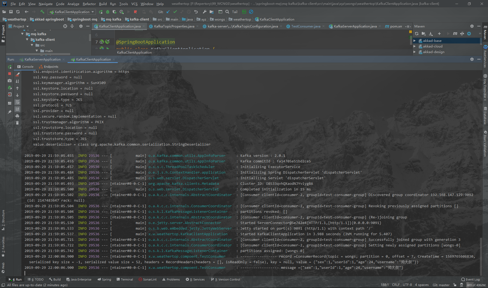
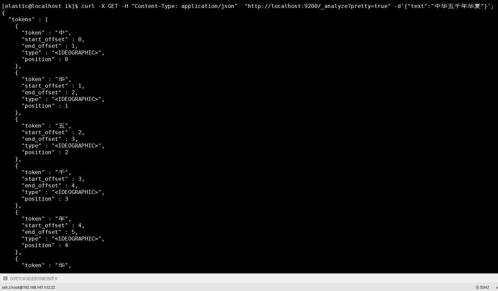
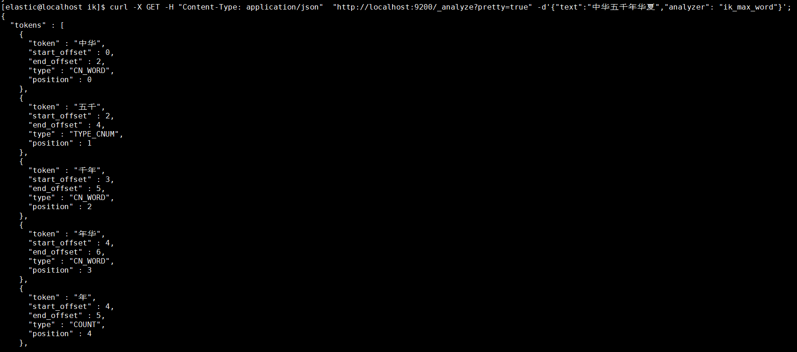
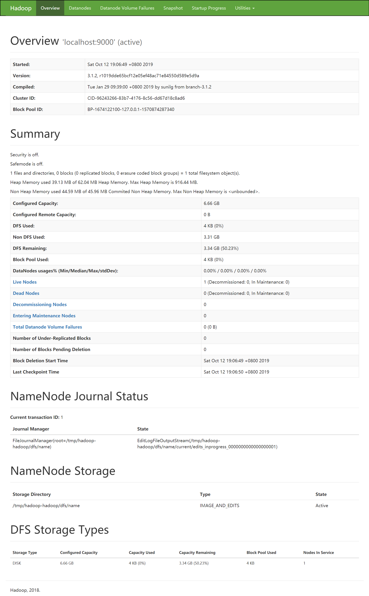

<!-- TOC -->

- [1. 目录结构](#1-目录结构)
- [2. persistence-mybatis](#2-persistence-mybatis)
- [3. akkad-cloud入门](#3-akkad-cloud入门)
    - [3.1. Nacos配置中心](#31-nacos配置中心)
    - [3.2. Nacos注册中心](#32-nacos注册中心)
    - [3.3. 网关Gateway](#33-网关gateway)
    - [3.4. 熔断Hystream](#34-熔断hystream)
- [4. akkad-java](#4-akkad-java)
    - [4.1. 设计模式akkad-design](#41-设计模式akkad-design)
- [5. SpringBoot入门](#5-springboot入门)
    - [5.1. JWT认证](#51-jwt认证)
    - [5.2. 消息Kafka](#52-消息kafka)
        - [5.2.1. 应用集成](#521-应用集成)
            - [5.2.1.1. 生产者](#5211-生产者)
            - [5.2.1.2. 消费者](#5212-消费者)
            - [5.2.1.3. 演示](#5213-演示)
- [6. 消息MQ](#6-消息mq)
    - [6.1. Kafka](#61-kafka)
        - [6.1.1. kafka安装](#611-kafka安装)
        - [6.1.2. 编写配置文件](#612-编写配置文件)
        - [6.1.3. 启动](#613-启动)
        - [6.1.4. 创建Topic](#614-创建topic)
        - [6.1.5. 查看Topic](#615-查看topic)
- [7. elasticsearch](#7-elasticsearch)
    - [7.1. 下载&安装](#71-下载安装)
        - [7.1.1. 下载](#711-下载)
        - [7.1.2. 安装](#712-安装)
        - [7.1.3. 修改配置文件](#713-修改配置文件)
        - [7.1.4. 启动&验证结果](#714-启动验证结果)
    - [7.2. 中文分词插件IK](#72-中文分词插件ik)
        - [安装](#安装)
        - [ik_max_word和ik_smart](#ik_max_word和ik_smart)
            - [ik_smart分词](#ik_smart分词)
            - [ik_max_word分词](#ik_max_word分词)
- [8. zookeeper安装](#8-zookeeper安装)
    - [8.1. 下载](#81-下载)
    - [8.2. 配置安装](#82-配置安装)
- [9. hadoop学习](#9-hadoop学习)
    - [9.1. 伪分布式环境部署](#91-伪分布式环境部署)
        - [9.1.1. 创建用户组、用户](#911-创建用户组用户)
        - [9.1.2. ssh安装配置免密登陆](#912-ssh安装配置免密登陆)
        - [9.1.3. hadoop安装](#913-hadoop安装)
            - [9.1.3.1. 下载](#9131-下载)
            - [9.1.3.2. 配置](#9132-配置)
        - [9.1.4. HBase安装](#914-hbase安装)
            - [9.1.4.1. 单机HBase配置](#9141-单机hbase配置)
            - [9.1.4.2. 集群模式<待补充>](#9142-集群模式待补充)
        - [9.1.5. Phoenix安装](#915-phoenix安装)
        - [9.1.6. hive安装](#916-hive安装)

<!-- /TOC -->

# 1. 目录结构

~~~

|-- akkad-base                      ------------------------------基包
|   |-- base-persistence            ------------------------------持久层包
|   |   |-- persistence-mybatis     ------------------------------Mybatis持久层基包
|   |-- base-utils                  ------------------------------通用工具包
|-- akkad-cloud                     ------------------------------SpringCloud入门
|   |-- cloud-config                ------------------------------基于Nacos实现的配置中心
|-- akkad-handball                  ------------------------------样例
|   |-- handball-location           ------------------------------爬虫获取统计局区域样例
|   |-- handball-tess4j             ------------------------------OCR图片识别
|-- akkad-java                      ------------------------------JAVA学习
|   |-- akkad-design                ------------------------------设计模式
|   |-- akkad-socket                ------------------------------Scoket编程
|   |   |-- socket-client           ------------------------------Client端
|   |   |-- socket-server           ------------------------------Server端
|   |-- akkad-thread                ------------------------------多线程
|-- akkad-job                       ------------------------------基于XXL-JOB实现调度中心
|   |-- job-sms                     ------------------------------调度中心样例
|-- akkad-springboot                ------------------------------SPRINGBOOT入门
|   |-- springboot-async            ------------------------------异步
|   |-- springboot-atomikos         ------------------------------分布式事务
|   |-- springboot-jwt              ------------------------------JWT认证
|   |-- springboot-mq               ------------------------------异步MQ
|   |   |-- mq-kafka                ------------------------------Kafka实现
|   |   |   |-- kafka-client        ------------------------------消费者
|   |   |   |-- kafka-server        ------------------------------生产者
|-- akkad-webmagic                  ------------------------------
|   |-- src
|   |-- target
|-- doc
|   |-- image
|-- README.md
~~~

# 2. persistence-mybatis

基于Mybatis组件并结合泛型实现**BaseMapper、BaseService**，子类继承该类，即可拥有通用的CURD，减少重复编码的麻烦，提高开发效率。

- 分页组件是继承开源**com.github.pagehelper**

~~~
<dependency>
    <groupId>com.github.pagehelper</groupId>
    <artifactId>pagehelper-spring-boot-starter</artifactId>
    <version>1.2.3</version>
</dependency>
~~~

- 在应用中PageHelper.startPage即可，后面需要紧跟着持久层语句，否则分页失效

~~~
    public PageInfo<T> selectPage(PaginationInfo pgInfo, T t) {
        PageHelper.startPage(pgInfo.getPageNum(), pgInfo.getPageSize());
        List<T> lt = getMapper().getList(t);
        PageInfo<T> pageInfo = new PageInfo<T>(lt);
        return pageInfo;
    }
~~~

# 3. akkad-cloud入门

## 3.1. Nacos配置中心

Nacos 支持基于 DNS 和基于 RPC 的服务发现（可以作为springcloud的注册中心）、动态配置服务（可以做配置中心）、动态 DNS 服务。

`官方介绍`
~~~
Nacos 致力于帮助您发现、配置和管理微服务。Nacos 提供了一组简单易用的特性集，帮助您实现动态服务发现、服务配置管理、服务及流量管理。
Nacos 帮助您更敏捷和容易地构建、交付和管理微服务平台。 Nacos 是构建以“服务”为中心的现代应用架构(例如微服务范式、云原生范式)的服务基础设施。
~~~

- pom依赖包

~~~
<dependency>
    <groupId>com.alibaba.boot</groupId>
    <artifactId>nacos-config-spring-boot-starter</artifactId>
    <version>0.1.2</version>
</dependency>
~~~

- application.yml

~~~
nacos:
  config:
    server-addr: 123.206.118.219:8848
~~~

## 3.2. Nacos注册中心

## 3.3. 网关Gateway

## 3.4. 熔断Hystream

# 4. akkad-java

## 4.1. 设计模式akkad-design

点击即可查看[观察设计模式](akkad-java/akkad-design/Observer.md)详细介绍

# 5. SpringBoot入门

## 5.1. JWT认证

- 加入依赖包

~~~
    <dependency>
        <groupId>com.auth0</groupId>
        <artifactId>java-jwt</artifactId>
        <version>${JWT.VERSION}</version>
    </dependency>
~~~

- 

## 5.2. 消息Kafka

### 5.2.1. 应用集成

加入依赖包

~~~
    <dependency>
        <groupId>org.springframework.kafka</groupId>
        <artifactId>spring-kafka</artifactId>
    </dependency>
~~~

#### 5.2.1.1. 生产者

- application.yml

~~~
spring:
  kafka:
    bootstrap-servers: 192.168.147.129:9092
    producer:
      retries: 0
      batch-size: 16384
      buffer-memory: 33554432
      key-serializer: org.apache.kafka.common.serialization.StringSerializer
      value-serializer: org.apache.kafka.common.serialization.StringSerializer
      properties:
        linger.ms: 1
~~~

- 发送消息

~~~
@RequestMapping("/kafka")
@RestController
public class TestKafkaProducerController {

    private Logger LOG = LoggerFactory.getLogger(TestKafkaProducerController.class);

    @Autowired
    private KafkaTemplate<String, String> kafkaTemplate;

    @RequestMapping("/send")
    public Response send(){
        String topic = "wongs";
        User user = User.getAuther();
        Response response = new Response();
        response.setData(user);
        String data = JSONObject.toJSON(user).toString();
        ListenableFuture<SendResult<String, String>> future = kafkaTemplate.send(topic, data);
        future.addCallback(new ListenableFutureCallback<SendResult<String, String>>() {
            @Override
            public void onFailure(Throwable ex) {
                LOG.error("kafka sendMessage error, ex = {}, topic = {}, data = {}", ex, topic, data);
            }

            @Override
            public void onSuccess(SendResult<String, String> result) {
                LOG.info("kafka sendMessage success topic = {}, data = {}",topic, data);
            }
        });
        return response;
    }
}
~~~

#### 5.2.1.2. 消费者

- application.yml

~~~
spring:
  kafka:
    bootstrap-servers: 192.168.147.129:9092
    consumer:
      group-id: test-consumer-group
      enable-auto-commit: true
      auto-commit-interval: 1000ms
      key-deserializer: org.apache.kafka.common.serialization.StringDeserializer
      value-deserializer: org.apache.kafka.common.serialization.StringDeserializer
      properties:
        session.timeout.ms: 15000
~~~

- 监听

~~~
@Slf4j
@Component
public class TestConsumer {

    @KafkaListener(topics = {"wongs"})
    public void listen (ConsumerRecord<?, ?> record) throws Exception {
        Optional<?> kafkaMessage = Optional.ofNullable(record.value());
        if (kafkaMessage.isPresent()) {
            Object message = kafkaMessage.get();
            log.info("----------------- record =" + record);
            log.info("------------------ message =" + message);
        }
    }
}

~~~

#### 5.2.1.3. 演示

# 6. 消息MQ

## 6.1. Kafka

### 6.1.1. kafka安装

[官方kafka_2.12-2.3.0下载](https://mirrors.tuna.tsinghua.edu.cn/apache/kafka/2.3.0/kafka_2.12-2.3.0.tgz)

**解压重命名等步骤略过，这些在Linux下通用操作，不懂问百度**

### 6.1.2. 编写配置文件

修改/data/kafka/config/server.properties，主要有以下

~~~
listeners=PLAINTEXT://192.168.147.129:9092
advertised.listeners=PLAINTEXT://192.168.147.129:9092
log.dirs=/data/kafka/tmp/kafka-logs

zookeeper.connect=localhost:2181
~~~

### 6.1.3. 启动

方便的话，编写一个启动脚本，不然每次挨个启动Zookeeper和Kafka，甚是麻烦

kafkastart.sh

~~~

!/bin/sh

sh $zookeeper_home/bin/zkServer.sh start &

sleep 12

sh /data/kafka/bin/kafka-server-start.sh  /data/kafka/config/server.properties &

~~~

### 6.1.4. 创建Topic

~~~
sh kafka-topics.sh --create --zookeeper 192.168.147.129:2181 --replication-factor 1 --partitions 1 --topic wongs
~~~

### 6.1.5. 查看Topic

~~~
sh kafka-topics.sh --list --zookeeper 192.168.147.129:2181
~~~

# 7. elasticsearch

## 7.1. 下载&安装

### 7.1.1. 下载

[官方elasticsearch下载](https://artifacts.elastic.co/downloads/elasticsearch/elasticsearch-7.4.0-linux-x86_64.tar.gz)，下载elasticsearch，目前最新的稳定版本为 7.4.0 版本.

### 7.1.2. 安装

~~~

[root@localhost download]$ pwd
/data/download/

[root@localhost download]$ wget https://artifacts.elastic.co/downloads/elasticsearch/elasticsearch-7.4.0-linux-x86_64.tar.gz

[root@localhost download]$ cd ../app/

[root@localhost app]$ mkdir elastic

[root@localhost app]$ useradd elastic -g dev

[root@localhost app]$ passwd elastic

[root@localhost app]$ chown -R elastic:dev elastic

[root@localhost app]$ su elastic

[elastic@localhost app]$ cd /elastic

[elastic@localhost elastic]$ cp ../../download/elasticsearch-7.4.0-linux-x86_64.tar.gz .

[elastic@localhost elastic]$ tar -zxvf elasticsearch-7.4.0-linux-x86_64.tar.gz

[elastic@localhost elastic]$ mv elasticsearch-7.4.0/ .

~~~

### 7.1.3. 修改配置文件

路径config/elasticsearch.yml

~~~
-- 允许外部IP访问
network.host: 0.0.0.0

-- 把这个注释先放开
cluster.initial_master_nodes: ["node-1", "node-2"]
~~~

### 7.1.4. 启动&验证结果

- 启动

~~~
[elastic@localhost elastic]$ ./bin/elasticsearch
~~~

- 验证结果

Elastic会在默认9200端口运行，打开地址：http://192.168.147.132:9200/

## 7.2. 中文分词插件IK

### 安装

ik插件地址： https://github.com/medcl/elasticsearch-analysis-ik，为了演示需要，这里选择wget方式。

- 下载
~~~
[root@localhost download]$ wget https://github.com/medcl/elasticsearch-analysis-ik/releases/download/v7.4.0/elasticsearch-analysis-ik-7.4.0.zip
~~~

- 安装插件

~~~
[elastic@localhost elastic]$ cd plugins

[elastic@localhost plugins]$ cd mkdir ik && cd ik

[elastic@localhost ik]$ cp ../../../download/elasticsearch-analysis-ik-7.4.0.zip .

[elastic@localhost ik]$ unzip elasticsearch-analysis-ik-7.4.0.zip
~~~

完成后重启es

- 验证分词器

使用crul命令，输入下面的URL地址，验证分词器是否成功。
~~~
[elastic@localhost elastic]$ curl -X GET -H "Content-Type: application/json"  "http://localhost:9200/_analyze?pretty=true" -d'{"text":"中华五千年华夏"}';
~~~

### ik_max_word和ik_smart

- **ik_max_word**: 将文本按最细粒度的组合来拆分，比如会将“中华五千年华夏”拆分为“五千年、五千、五千年华、华夏、千年华夏”，总之是可能的组合；

- **ik_smart**: 最粗粒度的拆分，比如会将“五千年华夏”拆分为“五千年、华夏”

**不添加分词类别，Elastic对于汉字默认使用standard只是将汉字拆分成一个个的汉字，而我们ik则更加的智能，下面通过几个案例来说明。**

#### ik_smart分词

在JSON格式中添加**analyzer**节点内容为**ik_smart**

~~~
[elastic@localhost elastic]$ curl -X GET -H "Content-Type: application/json"  "http://localhost:9200/_analyze?pretty=true" -d'{"text":"中华五千年华夏","analyzer": "ik_smart"}';
~~~

#### ik_max_word分词

在JSON格式中添加**analyzer**节点内容为**ik_max_word**

~~~
[elastic@localhost elastic]$ curl -X GET -H "Content-Type: application/json"  "http://localhost:9200/_analyze?pretty=true" -d'{"text":"中华五千年华夏","analyzer": "ik_max_word"}';
~~~

# 8. zookeeper安装

## 8.1. 下载

[官方zookeeper下载](https://zookeeper.apache.org/releases.html)，下载ZooKeeper，目前最新的稳定版本为 3.5.5 版本，用户可以自行选择一个速度较快的镜像来下载即可.

这边演示用的版本**zookeeper-3.4.13.tar.gz**

~~~

[root@localhost download]$ mv /data/zookeeper-3.4.13/ ../app/zookeeper/

~~~

## 8.2. 配置安装

- `修改配置文件`

路径/data/zookeeper-3.4.13/conf/下的**zoo_sample.cfg** 改名为**zoo.cfg**

~~~

数据文件存放目录
dataDir=/data/zookeeper-3.4.13/data/tmp
日志存放目录
dataLogDir=/data/zookeeper-3.4.13/data/log

~~~

- `启动`

~~~
[root@localhost zookeeper]$ cd ../app/zookeeper/
[root@localhost zookeeper]$ sh bin/zkServer.sh start &
~~~

# 9. hadoop学习

环境须知：
- CentOS7
- hadoop-3.1.2.tar.gz
- jdk8

Hadoop环境需要JAVA环境，所以首先得安装Java。

## 9.1. 伪分布式环境部署

### 9.1.1. 创建用户组、用户

~~~
[root@localhost app]$  groupadd dev
[root@localhost app]$  adduser hadoop
[root@localhost app]$  passwd hadoop
~~~

### 9.1.2. ssh安装配置免密登陆

~~~
[root@localhost app]$  su hadoop
[hadoop@localhost hadoop]$ ssh-keygen -t rsa
[hadoop@localhost hadoop]$ cat ~/.ssh/id_rsa.pub >> ~/.ssh/authorized_keys
[hadoop@localhost hadoop]$ chmod 0600 ~/.ssh/authorized_keys
~~~

测试输入
~~~
[hadoop@localhost hadoop]$  ssh localhost
~~~

### 9.1.3. hadoop安装

#### 9.1.3.1. 下载

[Hadoop下载](https://mirrors.cnnic.cn/apache/hadoop/common/hadoop-3.1.2/hadoop-3.1.2.tar.gz)

~~~
[hadoop@localhost hadoop]$  wget https://mirrors.cnnic.cn/apache/hadoop/common/hadoop-3.1.2/hadoop-3.1.2.tar.gz

[hadoop@localhost hadoop]$  tar zxvf hadoop-3.1.2.tar.gz

[hadoop@localhost hadoop]$  mv hadoop-3.1.2/ /data/app/hadoop/
~~~

#### 9.1.3.2. 配置

- etc/hadoop/core-site.xml，configuration配置为
~~~
<configuration>
    <property>
        <name>fs.defaultFS</name>
        <value>hdfs://localhost:9000</value>
    </property>
</configuration>
~~~

- 设置环境变量

~~~
export HADOOP_HOME=/data/app/hadoop/
export HADOOP_CONF_DIR=$HADOOP_HOME/etc/hadoop/
export HADOOP_COMMON_LIB_NATIVE_DIR=$HADOOP_HOME/lib/native/
export HADOOP_OPTS="-Djava.library.path=$HADOOP_HOME/lib"
~~~

~~~
[hadoop@localhost hadoop]$  vi ~/.bashrc
[hadoop@localhost hadoop]$  source ~/.bashrc
~~~

- 设置JAVA_HOME
etc/hadoop/hadoop-env.sh
~~~
export JAVA_HOME=/data/app/jdk8
~~~

- 初始化 格式化HDFS

~~~
[hadoop@localhost hadoop]$ pwd
/data/app/hadoop
[hadoop@localhost hadoop]$ ./bin/hdfs namenode -format

~~~

- 启动NameNode和DataNode

~~~
[hadoop@localhost hadoop]$ ./sbin/start-dfs.sh
~~~

**输入地址查看：**http://192.168.147.132:9870/

- 配置YARN

编辑etc/hadoop/mapred-site.xml，configuration配置为

~~~
<configuration>
    <property>
        <name>mapreduce.framework.name</name>
        <value>yarn</value>
    </property>
</configuration>
~~~

编辑etc/hadoop/yarn-site.xml，configuration配置为

~~~
<configuration>
    <property>
        <name>yarn.nodemanager.aux-services</name>
        <value>mapreduce_shuffle</value>
    </property>
</configuration>
~~~

- 启动YARN

~~~
[hadoop@localhost hadoop]$ ./sbin/start-yarn.sh
~~~

**输入地址查看：**http://192.168.147.132:8088/cluster

- 启动与停止
~~~
[hadoop@localhost hadoop]$ ./sbin/start-dfs.sh
[hadoop@localhost hadoop]$ ./sbin/start-yarn.sh

[hadoop@localhost hadoop]$ ./sbin/stop-dfs.sh
[hadoop@localhost hadoop]$ ./sbin/stop-yarn.sh
~~~

### 9.1.4. HBase安装

#### 9.1.4.1. 单机HBase配置

- conf/hbase-site.xml，configuration配置为

~~~
<configuration>
  <property>
    <name>hbase.rootdir</name>
    <value>hdfs://localhost:9012/hbase</value>
  </property>
  <property>
    <name>hbase.zookeeper.property.dataDir</name>
    <value>/home/hadoop/zookeeper</value>
  </property>
</configuration>
~~~

- 启动与关闭
~~~
[hadoop@localhost hbase]$   ./bin/start-hbase.sh

[hadoop@localhost hbase]$   ./bin/stop-hbase.sh
~~~

- jps查看

- 终端

~~~
[hadoop@localhost hbase]$   ./bin/hbase shell
~~~

- 禁用自带Zookeeper
conf/hbase-env.sh
~~~
[hadoop@localhost hbase]$   vi conf/hbase-env.sh
~~~

- 配置独立Zookeeper

这是官方文档推荐的做法，如果不拷贝 zoo.cfg，在 hbase-site.xml 中也可以对Zookeeper进行相关配置，但HBase会优先使用 zoo.cfg（如果有的话）的配置
~~~
[hadoop@localhost hbase]$   cp ../zookeeper/conf/zoo.cfg conf/
~~~

- hbase-site.xml配置

~~~
<property>
     <name>hbase.cluster.distributed</name>
     <value>true</value>
</property>
~~~

- 启动Zookeeper

~~~
[hadoop@localhost zookeeper]$ sh bin/zkServer.sh start
ZooKeeper JMX enabled by default
Using config: /data/app/zookeeper/bin/../conf/zoo.cfg
Starting zookeeper ... STARTED
~~~

#### 9.1.4.2. 集群模式<待补充>

### 9.1.5. Phoenix安装

版本要与HBase相匹配！

### 9.1.6. hive安装

[Hive下载](https://mirrors.tuna.tsinghua.edu.cn/apache/hive/hive-3.1.2/apache-hive-3.1.2-bin.tar.gz)

~~~
[hadoop@localhost hadoop]$  wget https://mirrors.tuna.tsinghua.edu.cn/apache/hive/hive-3.1.2/apache-hive-3.1.2-bin.tar.gz

[hadoop@localhost hadoop]$  tar zxvf apache-hive-3.1.2-bin.tar.gz

[hadoop@localhost hadoop]$  mv apache-hive-3.1.2 /data/app/haddop/
~~~